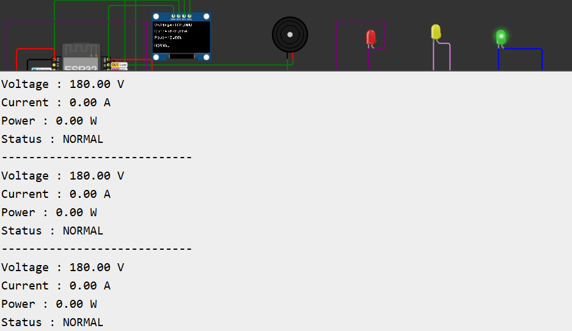
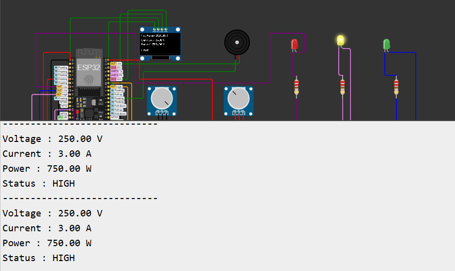
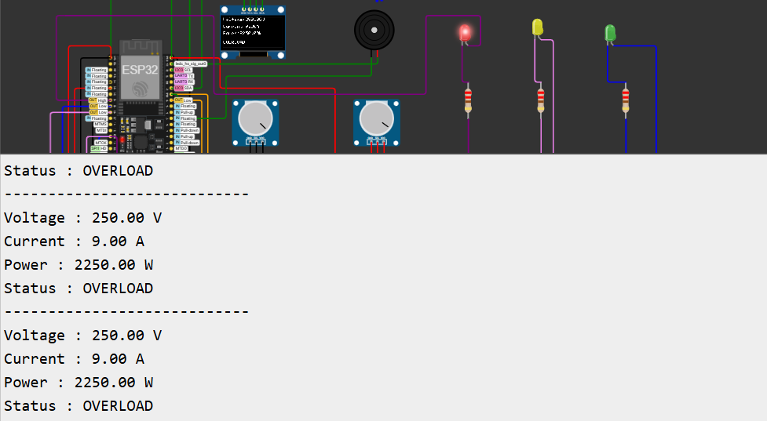
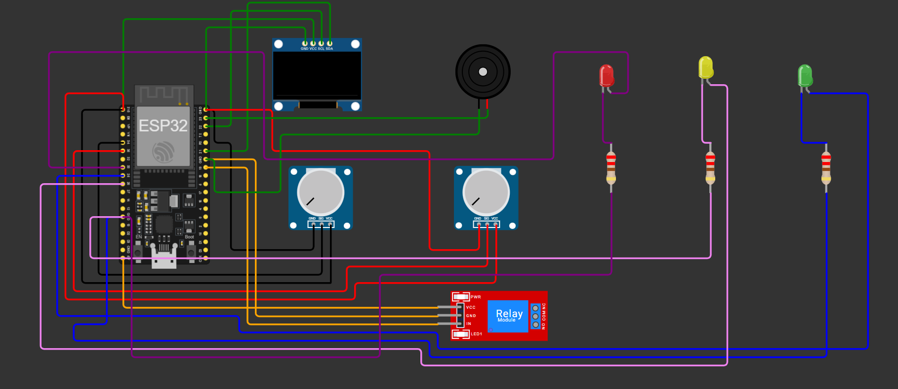
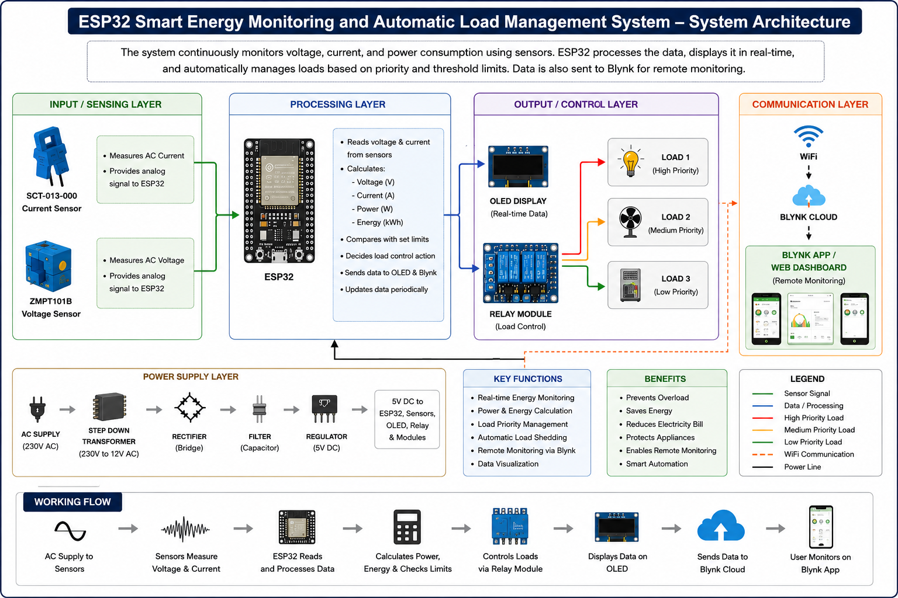

# ⚡ ESP32 Smart Energy Monitoring and Automatic Load Management System

## 📌 Project Overview

This project demonstrates an ESP32-based Smart Energy Monitoring and Automatic Load Management System using dual potentiometers, an OLED display, a relay module, LEDs, and a piezo buzzer in the Wokwi simulation platform.

The system continuously monitors simulated voltage and current values, calculates power consumption, and automatically classifies the electrical load into three operating modes: Normal, High Consumption, and Overload.

During overload conditions, the relay automatically disconnects the load while activating a buzzer and red LED for safety. Real-time electrical parameters and system status are displayed on both the OLED display and the Serial Monitor.

---

## ✨ Features

- Real-time voltage monitoring
- Real-time current monitoring
- Automatic power calculation
- OLED display for live monitoring
- Automatic relay-based load control
- Three operating modes
- LED status indication
- Piezo buzzer overload alert
- Serial Monitor output
- ESP32-based embedded system

---

## 🚦 Operating Modes

### 🟢 Normal Mode

When the calculated power is within the safe operating range:

- Green LED is ON
- Relay remains ON
- Buzzer is OFF
- OLED displays "NORMAL"

---

### 🟡 High Consumption Mode

When the power consumption becomes high but remains within the allowable limit:

- Yellow LED is ON
- Relay remains ON
- Buzzer is OFF
- OLED displays "HIGH"

---

### 🔴 Overload Mode

When the calculated power exceeds the overload threshold:

- Red LED is ON
- Relay automatically turns OFF
- Piezo buzzer is activated
- OLED displays "OVERLOAD"

---

## ⚙️ Working Principle

1. Potentiometer 1 simulates voltage input.
2. Potentiometer 2 simulates current input.
3. ESP32 continuously reads both analog values.
4. The system calculates electrical power using Voltage × Current.
5. Based on the calculated power, the system determines the operating mode.
6. The relay automatically disconnects the load during overload conditions.
7. LEDs and the buzzer provide visual and audible indications.
8. Real-time values are displayed on the OLED display and Serial Monitor.

---

## 🧰 Components Used

| Component | Quantity |
|-----------|---------:|
| ESP32 DevKit V1 | 1 |
| OLED SSD1306 Display | 1 |
| Potentiometer | 2 |
| Relay Module | 1 |
| Piezo Buzzer | 1 |
| Green LED | 1 |
| Yellow LED | 1 |
| Red LED | 1 |
| 220 Ω Resistor | 3 |
| Jumper Wires | As required |

The complete component list is available in:

[View Components List](Components_List.csv)

---

## 📷 Circuit Design

The complete Wokwi circuit design is shown below.

---

## 🏗️ System Architecture

The system architecture below illustrates how the ESP32 continuously monitors electrical parameters through the connected sensors, processes the measured data, and calculates voltage, current, power, and energy consumption. Based on predefined threshold values and load priorities, the ESP32 automatically controls the relay module to manage connected loads. Real-time system information is displayed on the OLED display, while energy data can also be transmitted for remote monitoring, enabling efficient energy management and automatic load control.

---

## 📄 Schematic Diagram

The complete wiring documentation is available here.

[View Schematic Diagram](Schematic_Diagram.pdf)

---

## 💻 ESP32 Code

The complete Arduino program is available in:

[View ESP32 Code](ESP32_Smart_Energy_Monitoring_and_Automatic_Load_Management_System.ino)

---

## 🔌 ESP32 GPIO Pin Configuration

| Component | ESP32 GPIO |
|-----------|------------|
| OLED SDA | GPIO 21 |
| OLED SCL | GPIO 22 |
| Voltage Potentiometer | GPIO 34 |
| Current Potentiometer | GPIO 35 |
| Relay Module | GPIO 19 |
| Piezo Buzzer | GPIO 23 |
| Green LED | GPIO 25 |
| Yellow LED | GPIO 26 |
| Red LED | GPIO 33 |

---

## 📊 Serial Monitor Output

The Serial Monitor displays real-time voltage, current, power, and operating status.

### 🟢 Normal Mode

### 🟡 High Consumption Mode

### 🔴 Overload Mode

---

## 🛠️ Software Used

- Wokwi Simulator
- Arduino IDE
- Arduino C/C++

---

## 🎯 Applications

- Smart energy monitoring
- Industrial load management
- Electrical safety systems
- Smart home automation
- Energy efficiency monitoring
- Embedded systems learning

---

## 🚀 Future Improvements

- IoT cloud monitoring
- Mobile application integration
- Smart meter communication
- Wi-Fi-based remote monitoring
- Historical energy data logging
- Automatic email/SMS alerts
- Renewable energy monitoring
- AI-based power usage prediction

---

## 👨‍💻 Author

**Shriram Prasanna K**

B.Tech Electronics and Communication Engineering

---

## 📜 Note

This project is a simulation-based prototype developed using Wokwi.

Voltage and current values are simulated using potentiometers, while the relay module demonstrates automatic load control for educational and embedded systems learning purposes.
